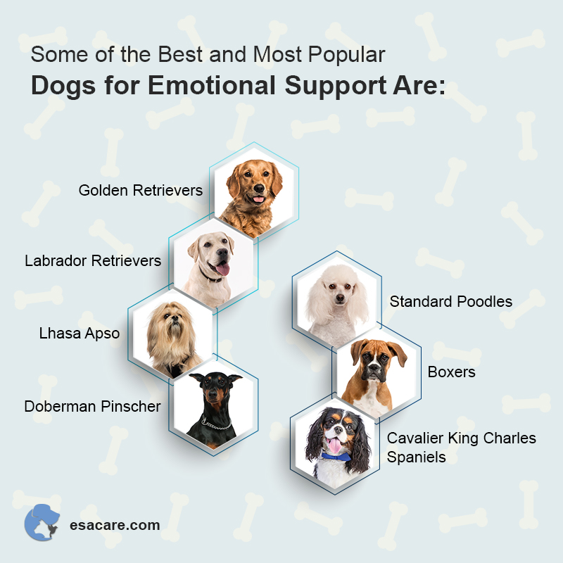
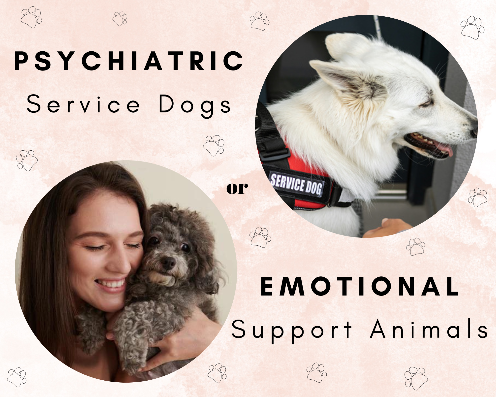

# The Difference Between Service Animals and Emotional Support Animals.
![image][ServiceVSESA.jpeg]

Mental health is something that is not talked about enough. This page will provide a breif description explaination of the differences between **Service Animals** and **Emotional support animals**.

## Service Dogs
Service dogs allow people with disabilities to live a full life. They can do things such as guiding someone who is blind, warning someone who is hard of hearing if someone is coming up behind them, and much more.

- *"Under the ADA, a service animal is defined as a dog that has been individually trained to do work or perform tasks for an individual with a disability.  The task(s) performed by the dog must be directly related to the person’s disability."*

## Emotional Support Animals

Emotional Support Animals or ESA animals help boost our mental health. ESA animals can be used in many situations such as a therapy dog in hospitals or as simple as helping you deal with your anxiety. The bond that you create with your animal can benefit your mental health.
### Examples
- Decrease levels of stress-related hormones
- Lower blood pressure
- Reduce loneliness
- Increase feelings of social support
- Boost mood

## Do I need a service animal or an ESA?

Unlike service animals, emotional support animals are limited in where they can be with their humans. Both service and emotional support animals can be prescribed by your doctor but there is a big difference between the 2. Emotional support animals help their humans cope with every day stressors while service animals go through specific training to help people with disabilities do every day things.

### See more
Here is a video of the legal differences between Service animals and Emotional Support [animals]("https://player.vimeo.com/video/537505220?h=b779cea63c")

## References
- [Learn more about FAQ regarding Service Animals](https://www.ada.gov/resources/service-animals-faqs/#:~:text=Dogs%20can%20be%20trained%20to,hearing%20loss%20when%20someone%20is)
- [Learn more about ESA](https://www.ivo.vet/blog/how-animals-support-mental-and-emotional-health?gclid=Cj0KCQjwpompBhDZARIsAFD_Fp8_jS-HW4f1Zp-Ohtm5EoojY0RqBRIS1nokiATeA4ranC2McXYsWTAaAjO-EALw_wcB)
- [Service animal or ESA?](https://blog.northwestbattlebuddies.org/blog/emotional-support-animals-professionally-trained-service-dogs?gclid=Cj0KCQjwpompBhDZARIsAFD_Fp84Yu2-sLR1vHre41NgPF3WEUV9ZkDO_fUC2tuppBv61WMBNeGBIcQaAjGxEALw_wcB)
